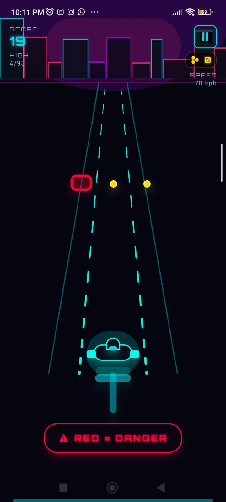
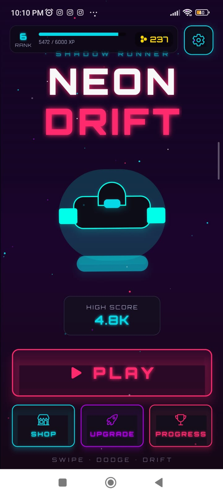
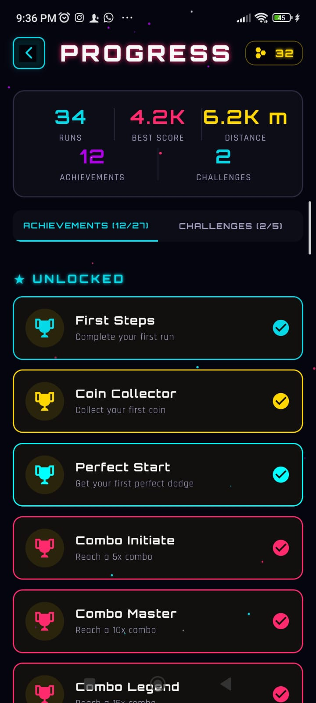

# SHADOW RUNNER: NEON DRIFT

A fast-paced cyberpunk arcade survival runner built for Android.

Drift through neon highways, dodge deadly hazards, chain perfect dodges, and survive impossible speeds in a synthwave-inspired futuristic world.

---

## FEATURES

* Cyberpunk synthwave visual style
* Smooth hovercraft drifting gameplay
* Endless survival arcade mechanics
* XP progression and achievements
* Dynamic audio and visual feedback
* Fully offline playable
* Optimized for Android devices

---

## DOWNLOAD

### itch.io

https://novacircuit.itch.io/shadow-runner-neon-drift

### GameJolt

https://novacircuit.gamejolt.io/shadow-runner-neon-drift

---

## SCREENSHOTS

---

## TECH STACK

* React Native
* Expo SDK 54
* TypeScript
* Expo Audio
* EAS Build

---

## STATUS

Public Beta v0.9

Focused on gameplay polish, player feedback, and mobile optimization before wider store deployment.

---

## DEVELOPER

NovaCircuit
